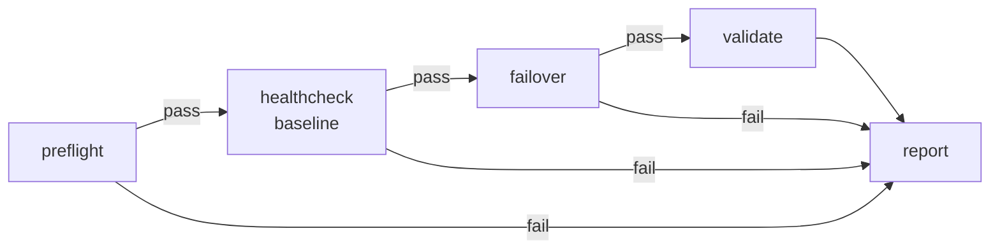

# k8s-dr-drill-runner

An automated, tool-agnostic disaster recovery drill runner for Kubernetes.
It replaces a manual, multi-team, runbook-driven DR exercise with a single
CLI pipeline that checks cluster readiness, captures a health baseline,
simulates a failover, validates the result, and produces a structured,
timestamped report — all in one run.

## Problem

In a regulated environment, DR drills aren't optional — they're a
recurring compliance requirement, and eventually someone with an audit
mandate asks for proof that failover actually works. In most places I've
seen, that proof is produced by hand: a person works through a runbook,
coordinates two or three other teams so nobody deploys mid-drill,
eyeballs dashboards to decide if things look healthy, triggers the
failover through a mix of scripts and manual commands, waits, and writes
up what happened afterward. That takes hours, and every manual step is a
place for something to go quietly wrong — a check skipped, a step run out
of order, an outcome remembered slightly wrong an hour later. The audit
trail, in the worst case, is whatever someone remembered to screenshot.

## What this does

`k8s-dr-drill-runner` runs a DR drill as a sequence of independently
runnable phases, each gating the next, using the official `kubernetes`
Python client against a target namespace:

1. **Preflight** — is it even safe to attempt a drill right now? Cluster
   reachable, nodes ready, enough resource quota headroom.
2. **Healthcheck (baseline)** — snapshot current deployment/endpoint
   health before anything is touched.
3. **Failover** — execute a config-driven, ordered sequence of mutations
   (scale the standby up, wait for it to be ready, shift a Service
   selector to it, scale the primary down).
4. **Validate** — re-measure the same signals and compare against the
   baseline, within a configured tolerance.
5. **Report** — emit a structured Markdown + JSON artifact covering every
   phase, every check, timestamps, operator identity, and the parameters
   used.

A failed phase stops the drill — later phases are recorded as `skipped`,
not attempted — and the report reflects exactly how far the drill got.

## Architecture



Each arrow into `report` from a failed phase carries a `skipped` result for
every phase after it — the report is produced regardless of where the
drill stopped.

```
preflight --> healthcheck (baseline) --> failover --> validate --> report
   |                |                        |            |
 fail -----------------------------------------------------> report
   (any failure short-circuits straight to reporting)
```

## Quickstart

```bash
python -m venv .venv
source .venv/bin/activate        # Windows: .venv\Scripts\activate

pip install -e ".[dev]"

# Run tests (fully mocked, no cluster required)
pytest -v

# Dry run: preflight + healthcheck only, never mutates cluster state
python -m drill.cli run --config config/drill-config.yaml --dry-run

# Full drill against whatever kube-context is active
python -m drill.cli run --config config/drill-config.yaml --operator you@example.com
```

Configuration lives in two files:

- `config/drill-config.yaml` — environment, namespace, and every timeout /
  retry / threshold used by each phase.
- `config/checks.yaml` — the inventory of deployments and services the
  drill actually inspects and fails over.

Generated reports land in `reports/` (gitignored). See
`docs/report-sample.md` for a full example of what a successful run
produces, and `docs/drill-playbook.md` for how to interpret a failed run.

## Design decisions

**Independently runnable, gating phases instead of one monolithic
script.** Each phase is a plain function that takes a Kubernetes API
client and config and returns a structured result — it has no idea what
ran before or after it. The CLI is the only place that knows about
ordering and failure policy. This makes each phase trivially unit
testable in isolation, and it means the drill's failure behavior (stop
vs. continue) is defined exactly once instead of scattered across
modules.

**Structured JSON + Markdown report instead of just logs.** Logs tell you
what happened if you were watching. A report is a durable, self-contained
artifact: operator, timestamps, exact parameters used, and per-phase,
per-check pass/fail — captured as a direct by-product of running the tool,
not as a separate write-up someone has to remember to produce afterward.
That's the difference between an audit trail and a transcript.

**Config-driven thresholds, not hardcoded values.** Every timeout, retry
count, expected replica count, and the entire failover step ordering comes
from `drill-config.yaml` / `checks.yaml`. None of the phase modules
contain a magic number. That means adapting the drill to a different
environment or a different failover strategy is a config change, not a
code change.

**Mocking the Kubernetes client in tests rather than requiring a live
cluster in CI.** Every phase function takes the API client as a parameter,
so tests substitute a `unittest.mock.MagicMock` for `CoreV1Api`/`AppsV1Api`
and assert on both the calls made and the resulting `PhaseResult`. This
means the full test suite runs in any CI environment with zero cluster
access, zero network calls, and zero flakiness from a real cluster's
state — the `real-drill` job that touches an actual cluster is kept
entirely separate and gated behind `workflow_dispatch`/`schedule`.

## Trade-offs and limitations

- **Failover here is simulated**, not a full multi-region traffic-manager
  cutover. It scales a standby Deployment and patches a Service selector
  within a single cluster — a stand-in for the broader class of DNS/global
  load balancer failover a production DR plan might use.
- **Single-cluster demo.** Real multi-region or multi-cluster DR
  typically involves cross-cluster state and a separate traffic-management
  layer this repo doesn't attempt to model.
- **No automatic rollback.** If a failover step fails partway through,
  the drill stops and reports exactly where — it does not attempt to
  automatically reverse completed steps. See `docs/drill-playbook.md` for
  manual recovery guidance.

## What I'd change at scale

- Integrate with a real traffic manager or DNS-based failover mechanism
  instead of a Service selector patch, for drills that need to prove
  cross-region behavior.
- Add Slack/PagerDuty notification hooks so a scheduled drill's result
  reaches the right people the moment it finishes, rather than sitting in
  a report file until someone looks.
- Multi-cluster drill orchestration, so one run can validate failover
  across more than one cluster/region in a single pass with one combined
  report.
- An automated "rollback of the rollback" for a failed failover step,
  rather than requiring manual recovery.

## License

MIT — see [LICENSE](LICENSE).
